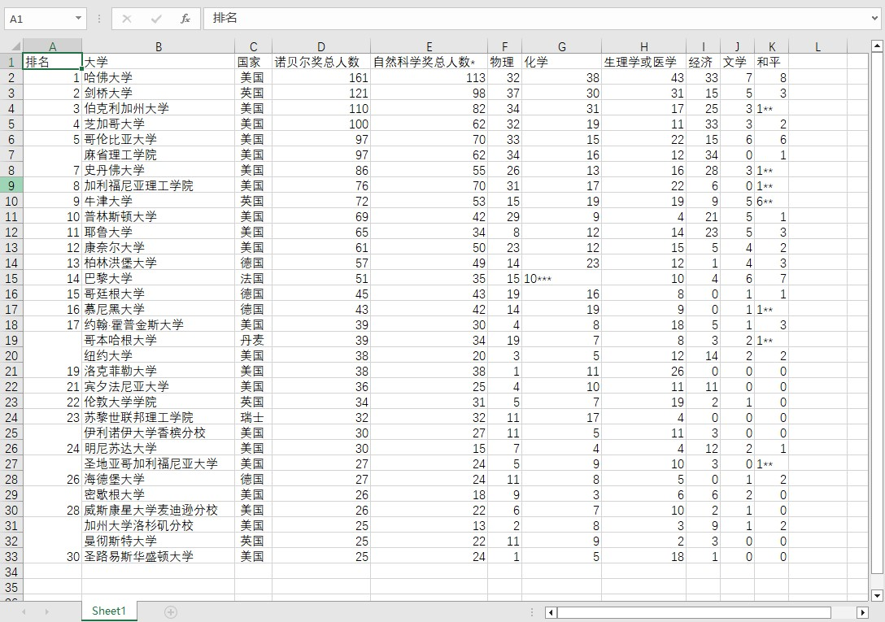
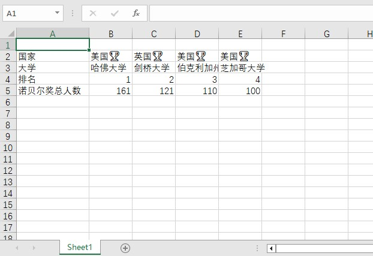

# excelflow

## 快速开始
### 读Excel
假设有如下excel，需要读取数据并构建Java对象供后续的业务逻辑消费：

首先，创建相应的Java对象，注意实现Serializable接口，并提供get、set方法：
```java
public class NobelPrize implements Serializable {
    private static final long serialVersionUID = 1L;

    private int ranking; // 排名
    private String university; // 大学
    private String country; // 国家
    private int total; // 诺贝尔奖总人数
    private int naturalScienceAwardTotal; // 自然科学奖总人数*
    private int physics; // 物理
    private String chemistry; // 化学
    private int physiologyOrMedicine; // 生理学或医学
    private int economy; // 经济
    private int literature; // 文学
    private String peace; // 和平
    
    // omitted getter and setter...
}
```

然后，配置并执行读excel，代码这么写：
```java
public class TestRead {
    public void readXlsx() throws IOException, ParserConfigurationException, OpenXML4JException, SAXException {
        // 结果
        List<NobelPrize> readResult = new ArrayList<>();

        try(InputStream is = ExcelFlow.class.getResourceAsStream("/excel/test1.xlsx")) {
            ExcelFlow.read(is).picks(
                    Picker.of(NobelPrize.class)
                            .sheet("Sheet1")
                            .cellMap(cellMappers -> cellMappers
                                    .cell("A2").prop(NobelPrize::getRanking)
                                    .cell("B2").prop(NobelPrize::getUniversity)
                                    .cell("C2").prop(NobelPrize::getCountry).val(country -> country.replaceAll("\u00a0", ""))
                                    .cell("D2").prop(NobelPrize::getTotal)
                                    .cell("E2").prop(NobelPrize::getNaturalScienceAwardTotal)
                                    .cell("F2").prop(NobelPrize::getPhysics)
                                    .cell("G2").prop(NobelPrize::getChemistry)
                                    .cell("H2").prop(NobelPrize::getPhysiologyOrMedicine)
                                    .cell("I2").prop(NobelPrize::getEconomy)
                                    .cell("J2").prop(NobelPrize::getLiterature)
                                    .cell("K2").prop(NobelPrize::getPeace)
                            )
                            .iterative(true)
                            .foward(Foward.Down)
                            .setStepLength(1)
                            .onPick(obj -> {
                                // System.out.println(obj);
                                readResult.add(obj);
                            })
            ).proccessEnd();
        }

    }
}

```
`readResult`即是我们想要的结果。

你可以把读excel这件事想象成在整齐的田间摘果，我们坐在单程车里，车从田地的左上至右下只跑一趟，我们想摘几种果子，就雇佣几个对应的"Picker"（采摘工），
`picker`每摘到一个果子，就触发一次`onPick`事件。

示例中的`Picker`对象用来配置我们想要读取的具体规则，
包括Java数据对象(`of()`)、sheet(`.sheet()`)、单元格位置(`.cell()`)、单元格与数据对象属性的映射关系(`.prop()`)、
读取数据后的回调函数(`.val()`)、迭代方向(`.foward()`)等。

## 写Excel
写excel的流程与读excel基本一致，还用`NobelPrize`作为例子，
现在我们想把上面读到的数据行列对调一下写入excel，代码这么写：
```java
public class WriteTest {
    public void writeXlsx() throws IOException, InvalidFormatException, SAXException, ParserConfigurationException {
        // 数据，为了演示，只写一部分
        NobelPrize[] nobelPrizes = {
                new NobelPrize().setCountry("美国").setUniversity("哈佛大学").setRanking(1).setTotal(161),
                new NobelPrize().setCountry("英国").setUniversity("剑桥大学").setRanking(2).setTotal(121),
                new NobelPrize().setCountry("美国").setUniversity("伯克利加州大学").setRanking(3).setTotal(110),
                new NobelPrize().setCountry("美国").setUniversity("芝加哥大学").setRanking(4).setTotal(100),
        };
        try (OutputStream os = new FileOutputStream("/temp/excelflow/export/test3.xlsx")) {
            ExcelFlow.write(os).record(
                    // 表头
                    Recorder.of()
                            .propMap(propMaps -> propMaps
                                    .cell("A2").val("国家")
                                    .cell("A3").val("大学")
                                    .cell("A4").val("排名")
                                    .cell("A5").val("诺贝尔奖总人数")
                            ),
                    // 表数据
                    Recorder.of(NobelPrize.class)
                            // 数据源，入参类型为Iterator
                            .source(Arrays.stream(nobelPrizes).iterator())
                            .propMap(propMaps -> propMaps
                                    .cell("B2").prop(NobelPrize::getCountry).val(country -> country + "🏆")
                                    .cell("B3").prop(NobelPrize::getUniversity)
                                    .cell("B4").prop(NobelPrize::getRanking)
                                    .cell("B5").prop(NobelPrize::getTotal)
                            )
                            .iterative(true)
                            .foward(Foward.Right)
            ).proccessEnd();
        }
    }
}
```
看，写跟读大体相似，最显著的为`Picker`换成了`Recorder`（语义化嘛），每个`recorder`多了数据源(`.source()`)的选项；
如果只写静态数据，就不用写`.source()`和传Java类型，正如第一个Recorder那样，在此示例中它相当于表头。

如果运行无误的话，将在输出目录里有个test3.xlsx，它是这样的：

