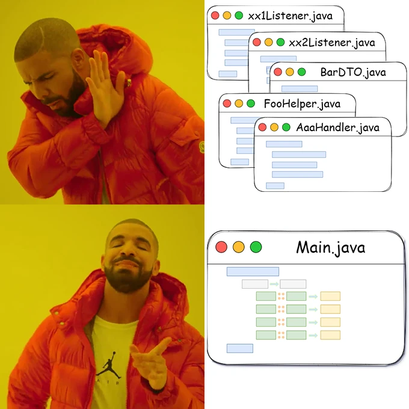

# excelflow
[](https://opensource.org/licenses/Apache-2.0)
[](https://central.sonatype.com/artifact/io.github.fengxxc/excelflow-core/0.4.1)

流式、优雅、连贯接口，读写Excel



## 快速开始
### 添加依赖

maven
```xml
<dependency>
  <groupId>io.github.fengxxc</groupId>
  <artifactId>excelflow-core</artifactId>
  <version>0.4.1</version>
</dependency>
```
Gradle
```
implementation group: 'io.github.fengxxc', name: 'excelflow-core', version: '0.4.1'
```
[download jar](https://s01.oss.sonatype.org/service/local/repositories/releases/content/io/github/fengxxc/excelflow-core/0.4.1/excelflow-core-0.4.1.jar)

### 读Excel
假设有如下excel，需要读取数据并构建Java对象供后续的业务逻辑消费：

首先，创建相应的Java对象，注意实现Serializable接口，并提供get、set方法：
```java
public class NobelPrize implements Serializable {
    private static final long serialVersionUID = 1L;

    private int ranking; // 排名
    private String university; // 大学
    private String country; // 国家
    private int total; // 诺贝尔奖总人数
    private int naturalScienceAwardTotal; // 自然科学奖总人数*
    private int physics; // 物理
    private String chemistry; // 化学
    private int physiologyOrMedicine; // 生理学或医学
    private int economy; // 经济
    private int literature; // 文学
    private String peace; // 和平
    
    // omitted getter and setter...
}
```

然后，配置并执行读excel，代码这么写：
```java
public class TestRead {
    public void readXlsx() throws IOException, ParserConfigurationException, OpenXML4JException, SAXException {
        // 结果
        List<NobelPrize> readResult = new ArrayList<>();

        try(InputStream is = new FileOutputStream("/temp/excelflow/export/test1.xlsx")) {
            ExcelFlow.read(is).picks(
                    Picker.of(NobelPrize.class)
                            .sheet("Sheet1")
                            .cellMap(cellMappers -> cellMappers
                                    .cell("A2").prop(NobelPrize::getRanking)
                                    .cell("B2").prop(NobelPrize::getUniversity)
                                    // 将"C2"单元格的值去掉不间断空格(\u00a0)并赋值到NobelPrize.country属性
                                    .cell("C2").prop(NobelPrize::getCountry).val(val -> val.replaceAll("\u00a0", ""))
                                    .cell("D2").prop(NobelPrize::getTotal)
                                    .cell("E2").prop(NobelPrize::getNaturalScienceAwardTotal)
                                    .cell("F2").prop(NobelPrize::getPhysics)
                                    .cell("G2").prop(NobelPrize::getChemistry)
                                    .cell("H2").prop(NobelPrize::getPhysiologyOrMedicine)
                                    .cell("I2").prop(NobelPrize::getEconomy)
                                    .cell("J2").prop(NobelPrize::getLiterature)
                                    .cell("K2").prop(NobelPrize::getPeace)
                            )
                            .foward(Foward.Down) // 迭代方向（默认向下）
                            .onPick(obj -> {
                                // 获得一个对象后的回调，obj即该对象
                                readResult.add(obj);
                            })
            ).proccessEnd();
        }

        // 打印结果
        for (int i = 0; i < readResult.size(); i++) {
            NobelPrize obj = readResult.get(i);
            System.out.println(obj);
        }
        /* 结果如下
         * NobelPrize{ranking=1, university='哈佛大学', country='美国', total=161, naturalScienceAwardTotal=113, physics=32, chemistry=38, physiologyOrMedicine=43, economy=33, literature=7, peace=8}
         * NobelPrize{ranking=2, university='剑桥大学', country='英国', total=121, naturalScienceAwardTotal=98, physics=37, chemistry=30, physiologyOrMedicine=31, economy=15, literature=5, peace=3}
         * NobelPrize{ranking=3, university='伯克利加州大学', country='美国', total=110, naturalScienceAwardTotal=82, physics=34, chemistry=31, physiologyOrMedicine=17, economy=25, literature=3, peace=1**}
         * NobelPrize{ranking=4, university='芝加哥大学', country='美国', total=100, naturalScienceAwardTotal=62, physics=32, chemistry=19, physiologyOrMedicine=11, economy=33, literature=3, peace=2}
         * NobelPrize{ranking=5, university='哥伦比亚大学', country='美国', total=97, naturalScienceAwardTotal=70, physics=33, chemistry=15, physiologyOrMedicine=22, economy=15, literature=6, peace=6}
         * NobelPrize{ranking=7, university='麻省理工学院', country='美国', total=97, naturalScienceAwardTotal=62, physics=34, chemistry=16, physiologyOrMedicine=12, economy=34, literature=0, peace=1}
         * ......
         * */

    }
}

```
上例中`readResult`即是我们想要的结果。

你可以把读excel这件事想象成在整齐的田间摘果，我们坐在单程车里，车从田地的左上至右下只跑一趟，我们想摘几种果子，就雇佣几个对应的"Picker"（采摘工），
`picker`每摘到一个果子，就触发一次`onPick`事件。

示例中的`Picker`对象用来配置我们想要读取的具体规则，
包括Java数据对象(`of()`)、sheet(`.sheet()`)、单元格位置(`.cell()`)、单元格与数据对象属性的映射关系(`.prop()`)、
读取数据后的回调函数(`.val()`)、迭代方向(`.foward()`)等。

### 写Excel
写excel的流程与读excel基本一致，还用`NobelPrize`作为例子，
现在我们想把上面读到的数据行列对调一下写入新的excel，代码这么写：
```java
public class WriteTest {
    public void writeXlsx() throws IOException, InvalidFormatException, SAXException, ParserConfigurationException {
        // 数据，为了演示，只写一部分
        NobelPrize[] nobelPrizes = {
                new NobelPrize().setCountry("美国").setUniversity("哈佛大学").setRanking(1).setTotal(161),
                new NobelPrize().setCountry("英国").setUniversity("剑桥大学").setRanking(2).setTotal(121),
                new NobelPrize().setCountry("美国").setUniversity("伯克利加州大学").setRanking(3).setTotal(110),
                new NobelPrize().setCountry("美国").setUniversity("芝加哥大学").setRanking(4).setTotal(100),
        };
        try (OutputStream os = new FileOutputStream("/temp/excelflow/export/test3.xlsx")) {
            ExcelFlow.write(os).record(
                    // 表头
                    Recorder.of()
                            .propMap(propMaps -> propMaps
                                    .cell("A2").val("国家")
                                    .cell("A3").val("大学")
                                    .cell("A4").val("排名")
                                    .cell("A5").val("诺贝尔奖总人数")
                            ),
                    // 表数据
                    Recorder.of(NobelPrize.class)
                            // 数据源，入参类型为Iterator
                            .source(Arrays.stream(nobelPrizes).iterator())
                            .propMap(propMaps -> propMaps
                                    .cell("B2").prop(NobelPrize::getCountry).val(country -> country + "🏆")
                                    .cell("B3").prop(NobelPrize::getUniversity)
                                    .cell("B4").prop(NobelPrize::getRanking)
                                    .cell("B5").prop(NobelPrize::getTotal)
                            )
                            .foward(Foward.Right) // 向右迭代
            ).proccessEnd();
        }
    }
}
```
看，写跟读大体相似，最显著的为`Picker`换成了`Recorder`（语义化嘛），每个`recorder`多了数据源(`.source()`)的选项；
如果只写静态数据，就不用写`.source()`和传Java类型，正如第一个Recorder那样，在此示例中它相当于表头。

如果运行无误的话，将在输出目录里有个test3.xlsx，它是这样的：


### 读转写
如果把上面“读”和“写”的两个例子看作一个需求的话，我们会很自然地想到，“读”与“写”串在一起，会比较酷。这个当然可以有~

只需把`.proccessEnd()`换成`.proccessThenWrite(os)`，其中参数`os`是输出流，`.proccessThenWrite(os)`就相当于`ExcelFlow.write(os)`，后面的配置与写Excel一致。下面是个例子：
```java
public class readToWriteTest {
    public void readTowriteXlsx() throws IOException, InvalidFormatException, SAXException, ParserConfigurationException {
        try(
                InputStream is = ExcelFlow.class.getResourceAsStream("/excel/test1.xlsx");
                OutputStream os = new FileOutputStream("F:\\temp\\excelflow\\export\\test1write.xlsx");
        ) {
            ExcelFlow.read(is).picks(
                    Picker.of(NobelPrize.class)
                            .sheet("Sheet1")
                            .cellMap(cellMappers -> cellMappers
                                    .cell("A2").prop(NobelPrize::getRanking).val(v -> ((int) v))
                                    .cell("B2").prop(NobelPrize::getUniversity).val(v -> "㊗" + v)
                                    .cell("C2").prop(NobelPrize::getCountry).val(country -> ((String) country).replaceAll("\u00a0", ""))
                                    .cell("D2").prop(NobelPrize::getTotal)
                                    .cell("E2").prop(NobelPrize::getNaturalScienceAwardTotal)
                                    .cell("F2").prop(NobelPrize::getPhysics)
                                    .cell("G2").prop(NobelPrize::getChemistry)
                                    .cell("H2").prop(NobelPrize::getPhysiologyOrMedicine)
                                    .cell("I2").prop(NobelPrize::getEconomy)
                                    .cell("J2").prop(NobelPrize::getLiterature)
                                    .cell("K2").prop(NobelPrize::getPeace)
                            )
                            .foward(Foward.Down)
            )
            .proccessThenWrite(os).record(
                    // 表头
                    Recorder.of(1) // 注意id，此处为1
                            .propMap(propMaps -> propMaps
                                    .cell("A2").val("国家")
                                    .cell("A3").val("大学")
                                    .cell("A4").val("排名")
                                    .cell("A5").val("诺贝尔奖总人数")
                            ),
                    // 表数据
                    Recorder.of(0, NobelPrize.class) // 注意id，此处为0
                            // 数据源，入参类型为Iterator
                            .source(Arrays.stream(nobelPrizes).iterator())
                            .propMap(propMaps -> propMaps
                                    .cell("B2").prop(NobelPrize::getCountry).val(country -> country + "🏆")
                                    .cell("B3").prop(NobelPrize::getUniversity)
                                    .cell("B4").prop(NobelPrize::getRanking)
                                    .cell("B5").prop(NobelPrize::getTotal)
                            )
                            .foward(Foward.Right) // 向右迭代
            ).proccessEnd();
        }
    }
}
```

这里有几点需注意，
- read部分的`Picker`的id要与write部分相应的`Recorder`的id保持一致（这样两条数据的“流”才有依据对接上）
- 如果没有显式赋值id，将以从0开始的自增序列作为id

在示例中，
read部分的`Picker`只有一个且没有写明id，那么它的id为`0`；
在write中的`Recorder`有两个，一个是表头，一个是数据，则表头的id手动赋`1`（或其他非0的值），数据部分的id赋`0`。

---
是不是很简单呢，ExcelFlow正如其名，像流一样操作excel，无论多么复杂的表格任务，一行代码就能搞定
（当然真写成一行会被同事和未来的自己打死，还是要适当换行 __(:з)∠)_）。

ExcelFlow是基于Apache POI的封装，使用SAX模式读文件、SXSSFWorkbook对象写文件，因此你无需担心大Excel爆内存的情况，
当然POI读Excel2007时解压缩全在内存中完成，如果文件特别大还是会很占内存，如果你有极端场景或对性能有极致追求，阿里的 [EasyExcel](https://github.com/alibaba/easyexcel) 或许更适合你。

## TODO
- [x] 支持直接映射Map
- [x] 读转写一条龙
- [ ] 对合并单元格的处理
- [ ] commit的处理
- [ ] 对形状、图片的处理
- [ ] 对象注解配置模式
- [ ] json配置模式
- [ ] 根据Excel模板读/写文件
- [ ] 支持其他类Excel程序文件（例如wps）

## LICENSE
Apache2.0